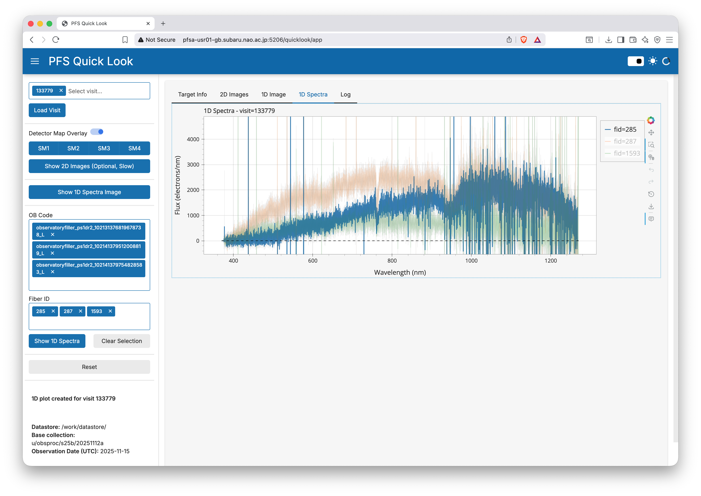

# PFS Quicklook Web App

This repository contains a web application for quicklook of data from the Prime Focus Spectrograph (PFS). The app is intended to be used by the summit/remote observers for quicklook of PSF data.

The app is supposed to replace the current `ipynb`-based quicklook tool (`check_quick_reduction_data.ipynb`).

## Prerequisites

You need to have access to one of PFSA servers to run this app. Also, you need a proper configuration file for database access. Please ask Moritani-san, Yabe-sa, or other relevant PFS obsproc team members for the configuration file.

## Installation and Setup

1. Activate LSST stack environment:

   ```bash
   source /work/stack/loadLSST.bash
   ```

2. Clone the repository and move into the directory:

   ```bash
   git clone https://github.com/Subaru-SciOp/pfs_quicklook.git
   cd pfs_quicklook
   ```

3. Create a directory to install additional Python pacakges which are not included in the LSST stack:

   ```bash
   mkdir -p /work/<your_username>/lsst-stack-local-pythonlibs
   ```

4. Install required Python packages using pip:

   ```bash
   # make sure to use the python3 from the LSST stack
   which python3
   # should return something like /work/stack-2025-06-06/conda/envs/lsst-scipipe-10.0.0/bin/python3
   python3 -m pip install --target=/work/<your_username>/lsst-stack-local-pythonlibs -r requirements.txt
   ```

5. Create and edit `.env` file:

   ```bash
   cp .env.example .env
   vi .env
   # nano .env  # if you prefer nano editor
   ```

   Make sure to set the correct values for the following variables in the `.env` file. An example is shown below:

   ```bash
   # datastore directory to fetch reduced data
    PFS_DATASTORE="/work/datastore"

    # name of the base collection for the reduction
    PFS_BASE_COLLECTION="<collection name for the night>"

    # observation date to be considered (YYYY-MM-DD format)
    # only single data is allowed
    PFS_OBSDATE_UTC="2025-05-26"

    # Auto-refresh interval for visit list (in seconds)
    # Set to 0 to disable auto-refresh
    # Default: 300 seconds (5 minutes)
    PFS_VISIT_REFRESH_INTERVAL=300

    # hostname to run the app
    # full hostname can be obtained by running `hostname -f` command
    PFS_APP_HOSTNAME=<your_server_hostname>

    # Location of additional Python packages
    # This will be used by pip when --target option is used
    LSST_PYTHON_USERLIB="/work/<your_username>/lsst-stack-local-pythonlibs"
   ```

6. Launch the app from the command line:

   ```bash
   # I recommend to run the script inside a screen or tmux session
   bash ./launch_app.bash
   ```

7. Access the app from your web browser:

   ```
   http://<your_server_hostname>:5106/quicklook/app
   ```

## Usage

### Load visits

1. Select the spectrograph (1 to 4) from the buttons on the top of the sidebar. All spectrographs are selected by default.
2. Select the visit from the `Visit` selection box. When focused, you will see the dropdown list of available visits. You can also type the visit number to search.
3. Once a visit is selected, press the `Load Data` button to load the data for the selected visit.
4. Visit list is automatically refreshed based on the interval set in the `.env` file.

Note: Currently, only single visit can be loaded at a time.

[](docs/img/screenshot_loadvisit.png)

### Inspect sky-subtracted 2D images

1. Press "Show 2D Images" button to display sky-subtracted 2D images for the selected visit. It takes sometime (typicall 1-2 minutes) to load and display the images.
2. You can pan and zoom the images using mouse controls.

[](docs/img/screenshot_2dimage.png)

### Inspect 1D gallery of spectra

1. Press "Show 1D Image" button to display a gallery of 1D spectra for the selected visit. It shows the `pfsMerged` file of the selected visit.
2. You can pan and zoom the spectra using mouse controls.
3. Mouse over a spectrum to see the fiber ID and other information in the tooltip.

[](docs/img/screenshot_pfsmerged.png)

### Inspect 1D spectra of specific fibers

1. Type or select either `OB Code` or `FiberId` in the corresponding boxes. When you set an input in one box, the corresponding value in the other box will be automatically updated.
2. Press "Show 1D Spectrum" button to display the 1D spectrum of the selected fiber.
3. You can pan and zoom the spectrum using mouse controls.
4. You can mute and unmute spectrum by clicking the legend entry.

[](docs/img/screenshot_1dspec.png)

## TODO

- DetectorMap overlay
- Coadd multiple visits
