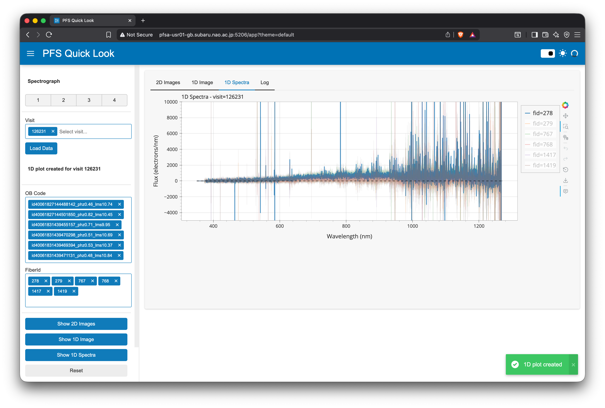

# Working with 1D Spectra

This guide explains how to visualize and interact with 1D spectra in PFS QuickLook. The application provides two complementary views: a **gallery view** showing all fibers at once, and an **individual view** for detailed inspection of selected fibers.

## Overview

1D spectral visualization allows you to:
- Assess spectral quality across all fibers (gallery view)
- Examine individual fiber spectra in detail (individual view)
- Compare spectra from different fibers
- Identify spectral features and measure properties
- Filter by observation code (OB Code) or fiber ID

## Prerequisites

Before viewing 1D spectra, you must:
1. [Load visit data](loading-data.md) first
2. Ensure the "Loaded visit" status message is displayed

## Two Views of 1D Spectra

### Gallery View (Plot 1D Image)

Shows all fiber spectra in a single 2D image representation:
- Each horizontal row = one fiber's spectrum
- Wavelength increases from left to right
- Color intensity represents flux level
- Quick overview of all fibers simultaneously

### Individual View (Plot 1D)

Shows selected fiber spectra as interactive line plots:
- Each fiber plotted with different color
- Wavelength on x-axis, flux on y-axis
- Error bands showing variance
- Detailed inspection and comparison

---

## Gallery View: 1D Image

### Creating the Gallery View

1. Click the **"Plot 1D Image"** button in the Plot Controls section
2. Wait for processing (~5-10 seconds)
3. Application automatically switches to the **1D Image** tab
4. Gallery view appears showing all fibers

**Note**: No fiber selection is required. The gallery view always shows all fibers from the `pfsMerged` file.

### Understanding the Gallery Layout

The gallery view displays a 2D image where:

- **Vertical axis**: Fiber ID (each row is one fiber)
- **Horizontal axis**: Wavelength (Angstroms)
- **Color**: Flux intensity
  - Brighter colors = higher flux
  - Darker colors = lower flux
  - Color scale automatically adjusted for optimal contrast

### Interactive Controls

The gallery view provides interactive controls through the Bokeh toolbar:

**Pan**:
- Click and drag to move around the image
- Useful for focusing on specific wavelength regions

**Zoom**:
- Scroll mouse wheel to zoom in/out
- Click and drag box to zoom into specific region
- Zoom vertically to focus on subset of fibers
- Zoom horizontally to focus on wavelength range

**Hover**:
- Move mouse over image to see tooltip
- Displays: Fiber ID, wavelength, and flux value
- Helps identify specific features

**Reset**:
- Click reset button to restore original view
- Useful after zooming/panning

### What to Look For

**Quality Indicators**:
- ✅ Continuous spectral features across fibers
- ✅ Similar overall flux levels for similar target types
- ✅ Clear spectral lines (emission or absorption)
- ✅ Smooth continuum

**Potential Issues**:
- ❌ Blank rows (missing or failed fibers)
- ❌ Unusually bright/dark fibers (processing issues)
- ❌ Discontinuities or gaps in spectra
- ❌ Systematic patterns across fibers (instrumental issues)

### Screenshot

The screenshot shows:
- Full gallery of fiber spectra
- Color-coded flux intensity
- Horizontal wavelength axis
- Vertical fiber ID axis
- Interactive Bokeh controls

### Use Cases

**Best for**:
- Quick overview of all fiber quality
- Identifying problematic fibers
- Spotting systematic issues
- Finding interesting spectral features across many fibers
- Initial quality assessment before detailed inspection

**Not ideal for**:
- Precise flux measurements
- Detailed line profile analysis
- Comparing specific fibers directly
→ Use Individual View for these tasks

---

## Individual View: Plot 1D

### Selecting Fibers

Before creating individual 1D plots, select which fibers to visualize. You have two methods:

#### Method 1: Select by OB Code

**OB Code** (Observation Code) identifies the type of observation or target:

Common examples:
- `obj_science` - Science targets
- `obj_sky` - Sky fibers
- `observatoryfiller_*` - Observatory filler targets
- `obj_fluxstd` - Flux standard stars

**To select by OB Code**:
1. Click the **OB Code** dropdown in Fiber Selection section
2. Select one or more OB codes from the list
3. **Fiber IDs automatically populate** with corresponding fibers
4. See bidirectional synchronization (below)

#### Method 2: Select by Fiber ID

**Fiber ID** ranges from 1 to 2604.

**To select by Fiber ID**:
1. Click the **Fiber ID** dropdown in Fiber Selection section
2. Select one or more fiber IDs from the list (can search by typing)
3. **OB Codes automatically populate** with corresponding codes
4. See bidirectional synchronization (below)

#### Bidirectional Synchronization

The OB Code and Fiber ID selections are **automatically linked**:

- Select OB Code → Fiber IDs auto-populate with matching fibers
- Select Fiber ID → OB Codes auto-populate with matching codes
- Add/remove selections in either box → other box updates automatically
- Manual adjustments allowed: You can add/remove individual items freely

**Example**:
1. Select OB Code: `obj_science`
2. Fiber IDs automatically populate with all science fibers
3. Manually remove a few fiber IDs
4. OB Code remains `obj_science` but with fewer fibers

### Creating Individual 1D Plots

1. **Select fibers** using OB Code or Fiber ID (see above)
2. Click **"Plot 1D"** button
3. Wait for processing (~2-5 seconds)
4. Application automatically switches to the **1D Spectra** tab
5. Interactive plot appears with selected fibers

**Note**: You must select at least one fiber before plotting.

### Understanding the Plot

The 1D Spectra plot shows:

**Axes**:
- **X-axis**: Wavelength (Angstroms)
- **Y-axis**: Flux (arbitrary units)

**Data**:
- Each fiber plotted as a colored line
- Colors cycle through palette (Category10: up to 10 distinct colors)
- Error bands (shaded regions) show variance/uncertainty
- Multiple fibers overlaid for comparison

**Legend**:
- Right side of plot
- Shows each fiber with:
  - Fiber ID
  - Object ID
  - OB Code
  - Color indicator

### Interactive Controls

**Pan**:
- Click and drag on plot area to move around
- Useful for examining different wavelength regions

**Zoom**:
- **Wheel zoom**: Scroll to zoom in/out
- **Box zoom**: Click and drag to zoom into region (default tool)
- Zoom in both x (wavelength) and y (flux) directions

**Hover**:
- Move mouse over plot to see tooltip
- Displays for each fiber:
  - Fiber ID
  - Object ID
  - OB Code
  - Wavelength
  - Flux value

**Legend Interaction** (Important!):
- **Click legend entry** to mute/unmute that fiber
- Muted fibers become faint (not completely hidden)
- Click again to restore
- **Default behavior**: Only first fiber visible, others muted
  - Click legend entries to show additional fibers
  - Prevents cluttered display with many fibers

**Other Tools**:
- **Undo/Redo**: Undo or redo zoom/pan actions
- **Reset**: Restore original view
- **Save**: Download plot as PNG image

### Screenshot

The screenshot shows:
- Multiple fiber spectra overlaid with different colors
- Interactive legend on right side
- Wavelength vs flux plot
- Error bands (shaded regions)
- Interactive Bokeh toolbar

### Tips for Effective Use

#### Comparing Similar Targets

To compare fibers with similar targets:
1. Select fibers using appropriate OB Code (e.g., `obj_science`)
2. Plot the spectra
3. Click legend entries to show/hide specific fibers
4. Look for consistency in:
   - Continuum shape
   - Spectral line positions and strengths
   - Overall flux level
   - Noise characteristics

#### Identifying Outliers

To find problematic fibers:
1. Plot several fibers of the same type
2. Toggle fibers on/off using legend
3. Look for fibers that:
   - Have very different flux levels
   - Show unusual spectral features
   - Have higher noise
   - Missing wavelength ranges

#### Examining Spectral Features

To study specific features:
1. Plot relevant fibers
2. Use box zoom to focus on wavelength region of interest
3. Use hover to get exact wavelength and flux values
4. Compare feature across different fibers

#### Managing Many Fibers

When plotting many fibers:
1. Remember: Only first fiber visible by default
2. Click legend entries one at a time to add fibers
3. Mute fibers you're not currently examining
4. Use different OB Codes to reduce number of fibers
5. Or select specific fiber IDs for targeted comparison

## Workflow Examples

### Example 1: Quick Quality Check

**Goal**: Verify science fiber quality

1. Load visit data
2. Select OB Code: `obj_science`
3. Click "Plot 1D"
4. Toggle through fibers using legend
5. Look for obvious issues (low flux, high noise, gaps)

### Example 2: Sky Subtraction Quality

**Goal**: Compare sky and science fibers

1. Load visit data
2. Plot 1D Image for overview
3. Select OB Codes: `obj_sky` and `obj_science`
4. Click "Plot 1D"
5. Toggle fibers to compare:
   - Sky fibers should show primarily sky lines
   - Science fibers should have sky lines subtracted
   - Look for residual sky lines in science fibers

### Example 3: Standard Star Check

**Goal**: Examine flux standard star spectrum

1. Load visit data
2. Select OB Code: `obj_fluxstd`
3. Click "Plot 1D"
4. Examine:
   - Smooth continuum shape
   - Expected spectral features
   - Signal-to-noise ratio
   - Wavelength coverage

## Data Processing Details

### Data Source

Individual 1D spectra are retrieved from:
- **pfsMerged** data product: Merged spectra from all arms
- Combines blue, red, NIR (and medium-red) arm data
- Provides continuous wavelength coverage
- Includes variance information for error bands

### Flux and Variance

The plot displays:
- **Main line**: Flux measurements
- **Shaded band**: ±1σ uncertainty (from variance)
- **Units**: Arbitrary flux units (not calibrated)

### Y-axis Range

The y-axis range is automatically calculated using:
- 0.5th to 99.5th percentile of flux values
- Provides good dynamic range for most spectra
- Excludes extreme outliers
- Prevents single bad pixel from dominating scale

**Note**: If specific y-axis limits are needed, this feature is not currently available in the UI but is planned for future releases.

## Current Limitations

### Multi-Visit Comparison

**Currently**: Only single visit can be loaded at a time

**Planned**: Future release will support:
- Multi-visit stacking for improved S/N
- Side-by-side comparison of visits
- Time-series analysis

### Export Options

**Currently**: Only PNG export via save button

**Planned**: Future releases will add:
- HTML export (preserves interactivity)
- CSV/FITS export of data
- Batch export of multiple fibers

### Spectral Line Tools

**Currently**: No built-in line identification or measurement

**Planned**: Future releases may add:
- Line identification overlay
- Equivalent width measurement
- Redshift/velocity measurement
- Reference spectrum comparison

## Troubleshooting

### "Plot 1D" Button Disabled

**Symptom**: Cannot click "Plot 1D" button

**Solutions**:
1. Ensure visit data is loaded first (click "Load Data")
2. Check status display shows "Loaded visit XXXXX"
3. Select at least one fiber (OB Code or Fiber ID)

### No Spectra Visible

**Symptom**: Plot appears but no lines visible

**Solutions**:
1. Check legend - only first fiber visible by default
2. Click legend entries to show additional fibers
3. Check that fibers are not muted (grayed out in legend)
4. Use reset button to restore default view

### Very Noisy Spectra

**Symptom**: Spectra show high noise level

**This may be normal**:
- Some targets are intrinsically faint
- Short exposures have higher noise
- Some wavelength regions have lower sensitivity

**Check**:
1. Compare with other fibers of same type
2. Verify exposure time and seeing conditions
3. Check data reduction logs for issues

### Missing Wavelength Regions

**Symptom**: Gaps in spectra at certain wavelengths

**Possible causes**:
1. Gaps between arms (normal at arm boundaries)
2. Bad detector regions masked during reduction
3. Data quality issues in specific arms

**Solutions**:
1. Check 2D images for same wavelength region
2. Consult data reduction team if unexpected
3. Compare with other fibers

### Plot Performance Issues

**Symptom**: Slow or laggy plot interaction

**Solutions**:
1. Reduce number of fibers plotted
2. Close other browser tabs
3. Refresh browser page
4. Check server load with administrator

## See Also

- [Loading Data](loading-data.md) - How to load visit data
- [2D Images](2d-images.md) - Viewing 2D spectral images
- [User Guide Overview](index.md) - Complete workflow
- [Troubleshooting](../troubleshooting.md) - Common issues and solutions
