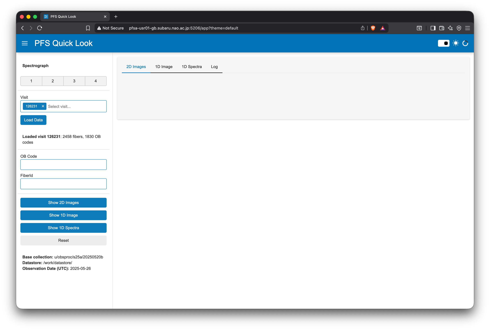

# Loading Visit Data

This guide explains how to load visit data into PFS QuickLook for visualization and analysis.

## Overview

Loading visit data is the first step in the QuickLook workflow. This operation retrieves the fiber configuration and prepares the application for creating 2D and 1D visualizations.

## Before You Start

### Check Configuration

Before loading data, verify the configuration display in the sidebar shows the correct settings:

- **Datastore**: Path to the Butler datastore (e.g., `/work/datastore`)
- **Base Collection**: Collection name for the observation night (e.g., `u/obsproc/s25a/20250520b`)
- **Observation Date**: UTC date for filtering visits (e.g., `2025-05-26` or `TODAY`)

This configuration is loaded from the server's `.env` file and automatically updates when you reload your browser session. If the settings look incorrect, contact your administrator.

## Step-by-Step Instructions

### 1. Select Spectrograph(s)

In the sidebar's **Instrument Settings** section, select which spectrographs you want to visualize:

- Use the checkbox group to select one or more spectrographs (1, 2, 3, or 4)
- All spectrographs are selected by default
- You can deselect any spectrograph you don't need

**Tip**: Selecting fewer spectrographs reduces loading time for 2D images.

### 2. Select Visit

In the **Data Selection** section, choose a visit from the dropdown menu:

1. Click on the **Visit** selection box
2. A dropdown list appears showing available visits
3. Visits are sorted with **newest first** for easy access to recent observations
4. You can:
   - Scroll through the list to browse available visits
   - Type a visit number to search (e.g., typing `126714` will filter to matching visits)

**About Visit Lists**:
- The visit list is automatically discovered when you first load the page
- Initial discovery may take 10-20 seconds depending on the number of visits
- Visit list automatically refreshes based on the configured interval (default: 5 minutes)
- Only visits matching the configured observation date are shown

### 3. Load Data

Once you've selected a visit:

1. Click the **"Load Data"** button
2. The application will:
   - Retrieve the pfsConfig (fiber configuration) from the Butler datastore
   - Populate the OB Code dropdown with available observation codes
   - Enable the Plot 2D, Plot 1D, and Plot 1D Image buttons
3. Watch the status display for confirmation

### 4. Verify Loading Success

After loading completes, you should see:

✅ **Status message**: `Loaded visit XXXXX: N fibers, M OB codes`
- `XXXXX` is your visit number
- `N` is the total number of fibers
- `M` is the number of unique OB codes

✅ **OB Code dropdown**: Now populated with available observation codes

✅ **Fiber ID dropdown**: Now populated with all fiber IDs (1-2604)

✅ **Plot buttons**: Now enabled and ready to use

✅ **pfsConfig tab**: Automatically switched to show fiber configuration table

## Understanding the pfsConfig Tab

After loading data, the application automatically switches to the **pfsConfig** tab, which displays:

### Visit Header Information

At the top of the tab, you'll see:
- **pfsDesignId**: Design identifier (hexadecimal)
- **RA/Dec Boresight**: Telescope pointing coordinates
- **Position Angle**: Rotator position
- **Arms**: Which spectrograph arms have data
- **Design Name**: Observation design name (if available)

### Fiber Configuration Table

An interactive table showing details for each fiber:

**Columns**:
- **fiberId**: Fiber identifier (1-2604)
- **spectrograph**: Which spectrograph module (1-4)
- **objId**: Object identifier
- **obCode**: Observation code (e.g., `obj_sky`, `obj_science`)
- **ra/dec**: Target coordinates
- **catId**: Catalog identifier
- **targetType**: Type of target
- **fiberStatus**: Fiber status (e.g., `GOOD`, `BROKENFIBER`)
- **proposalId**: Proposal identifier

**Table Features**:
- **Pagination**: 250 rows per page
- **Filtering**: Click column headers to filter by value
- **Visual styling**:
  - **Bold text**: SCIENCE targets with GOOD status (important targets)
  - **Bold gray**: SCIENCE targets with problematic status
  - **Gray**: SKY and FLUXSTD targets
  - **Light gray**: Other target types

**Table Controls**:
- Sort by clicking column headers
- Filter using header text boxes
- Navigate pages using pagination controls at bottom

## Screenshot

The screenshot shows:
- Spectrograph selection checkbox group
- Visit selection dropdown (with search capability)
- Load Data button
- Status display showing loaded visit information
- OB Code and Fiber ID dropdowns (populated after loading)

## Visit Auto-Refresh

The visit list automatically refreshes at the configured interval:

- **Default**: Every 5 minutes (300 seconds)
- **Purpose**: Automatically discover new visits as they become available
- **Notification**: A toast notification appears when refresh begins
- **Background**: Refresh runs in background without blocking the UI

You can continue working with loaded data while the visit list refreshes.

**Note**: The refresh interval is configured by administrators in the `.env` file. Contact your administrator if you need to adjust the frequency or disable auto-refresh.

## Current Limitations

### Single Visit Only

**Currently**: Only one visit can be loaded at a time.

If you load a new visit:
- Previous visit data is cleared
- All plots are removed
- Fiber selections are reset

**Future**: Multi-visit stacking is planned for a future release.

### Visit Selection

You must manually select a visit from the dropdown. There is no automatic loading of the most recent visit when the page loads.

## Troubleshooting

### No Visits Found

**Symptom**: Visit dropdown is empty

**Possible Causes**:
1. No data for the configured observation date
2. Incorrect base collection name
3. Datastore path is incorrect

**Solutions**:
1. Check the configuration display - verify date, collection, and datastore
2. Try changing observation date (requires administrator to update `.env`)
3. Contact administrator to verify configuration
4. Check with data reduction team that data exists for the desired date

### "Load Data" Button Doesn't Work

**Symptom**: Button click has no effect

**Solutions**:
1. Verify a visit is selected in the dropdown
2. Check browser console for JavaScript errors (F12 → Console tab)
3. Try reloading the browser page
4. Check that browser WebSocket connection is active

### Slow Loading

**Symptom**: Loading takes longer than expected (>10 seconds)

**Possible Causes**:
1. Network latency to datastore
2. Large pfsConfig file
3. Server under heavy load

**Solutions**:
1. Wait patiently - first load after application restart may be slower
2. Subsequent loads should be faster due to caching
3. Contact administrator if consistently slow

### Wrong Configuration Displayed

**Symptom**: Configuration display shows incorrect or outdated values

**Solutions**:
1. Reload your browser page (F5 or Ctrl+R)
   - Configuration is loaded fresh on each browser session start
2. Contact administrator to verify `.env` file on server

## What Happens Next?

After successfully loading visit data, you can:

1. **View fiber configuration**: Already displayed in pfsConfig tab
2. **Create 2D images**: See [2D Images Guide](2d-images.md)
3. **View 1D spectra**: See [1D Spectra Guide](1d-spectra.md)
4. **Select specific fibers**: Use OB Code or Fiber ID dropdowns for filtering

## See Also

- [User Guide Overview](index.md) - Complete workflow
- [2D Images](2d-images.md) - Next step: visualizing 2D data
- [Troubleshooting](../troubleshooting.md) - Common issues and solutions
